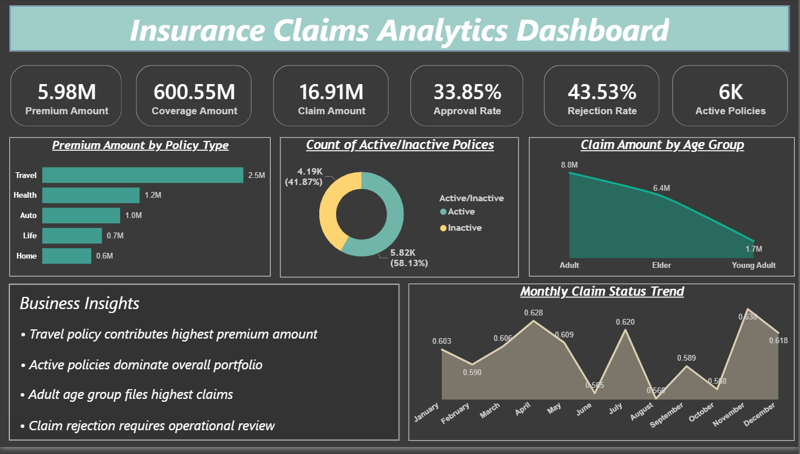
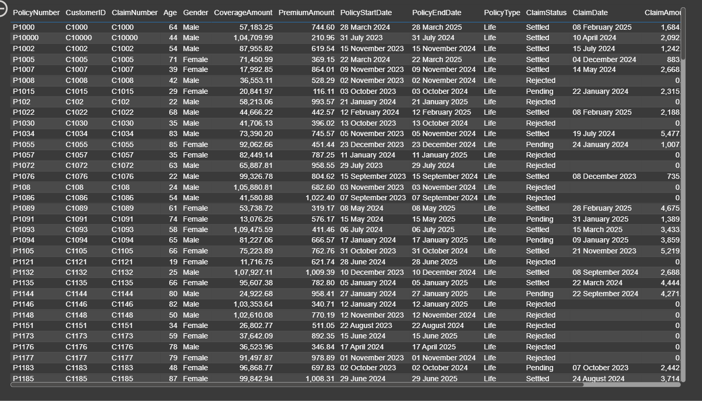
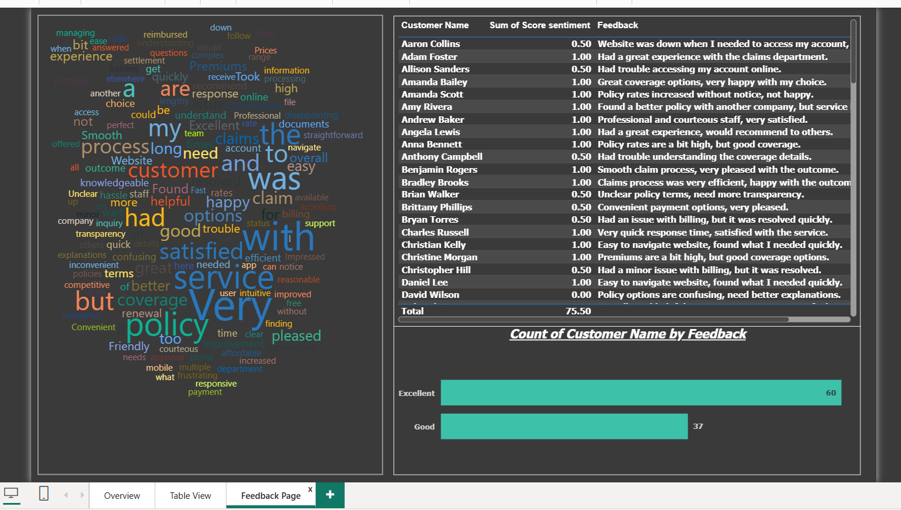

# 📋 Insurance Claims Analytics Dashboard using Power BI


---

## 📌 Project Overview

This project presents an **end-to-end insurance analytics solution** built in Power BI that covers policy performance, claims processing efficiency, customer demographics, and customer satisfaction trends.

The project combines:
- 📊 **Power BI** — 3 interactive business intelligence dashboards
- 🧮 **DAX** — Dynamic KPI measures & calculated fields
- 💬 **Sentiment Analysis** — Customer feedback analytics with word cloud
- ☁️ **Power BI Service** — Cloud deployment for online access & sharing

> The dataset contains real-world structured insurance records analyzed in Power BI to produce business insights across claims, policies, and customer experience.

---

## 🎯 Project Objectives

This project answers key business questions such as:

- Which insurance policy type generates the highest premium revenue?
- What percentage of claims are approved, rejected, or pending?
- Which customer age group files the highest claim amounts?
- How many policies are currently active versus inactive?
- How does claim status trend across months?
- What does customer feedback reveal about service quality?

---

## 📊 Dashboard Screenshots

### 1. Overview Dashboard


### 2. Table View


### 3. Feedback Analysis Page


---

## 🛠️ Tools & Technologies

| Tool | Purpose |
|---|---|
| Power BI Desktop | Dashboard development & data modeling |
| DAX | Dynamic KPI measures & calculated fields |
| Power Query (M) | Data transformation & cleaning |
| Excel (.xlsx) | Customer feedback dataset |
| CSV | Main insurance dataset |
| Power BI Service | Cloud publishing & sharing |

---

## ⚙️ Setup & Usage

### Step 1 — Clone the Repository
```bash
git clone https://github.com/abhi14324/insurance-claims-dashboard.git
cd insurance-claims-dashboard
```

### Step 2 — Open Power BI Dashboard
1. Open `Insurance_Claims_Analytics_Dashboard.pbix` in Power BI Desktop
2. Click **Home → Refresh** to load the latest data
3. Explore all 3 dashboard pages using the navigation tabs

### Step 3 — View Online
> Open the live published report directly in your browser — no installation needed.

---

## 📁 Project Structure

```
insurance-claims-dashboard/
│
├── dataset/
│   ├── Insurance_Dataset.csv                         ← Main insurance dataset
│   └── Insurance_Customer_Feedback.xlsx              ← Customer feedback dataset
│
├── dax_measures/
│   └── measures_table.txt                            ← All DAX measures
│
├── screenshots/
│   ├── Overview.png
│   ├── Table_View.png
│   └── Feedback.png
│
├── Insurance_Claims_Analytics_Dashboard.pbix         ← Power BI dashboard file
├── Insurance_Project_Documentation.docx              ← Full project documentation
└── README.md
```

---

## 📋 Dataset Description

The dataset contains structured insurance records with **14 columns**:

| Column | Description |
|---|---|
| PolicyNumber | Unique policy identifier |
| CustomerID | Unique customer identifier |
| ClaimNumber | Unique claim identifier |
| Age | Customer age |
| Gender | Customer gender (Male / Female) |
| CoverageAmount | Total insured coverage value |
| PremiumAmount | Premium amount paid by customer |
| PolicyStartDate | Date the policy became active |
| PolicyEndDate | Date the policy expires |
| PolicyType | Travel / Health / Auto / Life / Home |
| ClaimStatus | Settled / Rejected / Pending |
| ClaimDate | Date the claim was filed |
| ClaimAmount | Amount claimed by the customer |
| Active/Inactive | Current policy status |

A separate **Customer Feedback dataset** (Excel) was used for sentiment analysis.

---

## 💡 Key Business Logic

### Claim Status Classification

```
Settled   → Claim fully processed and paid  ✅
Rejected  → Claim denied by the insurer     ❌
Pending   → Claim still under review        ⏳
```

### Approval & Rejection Rate Calculation

```DAX
Claim Approval Rate =
DIVIDE(
    CALCULATE(COUNTROWS('InsuranceData'), 'InsuranceData'[ClaimStatus] = "Settled"),
    COUNTROWS('InsuranceData')
)

Claim Rejection Rate =
DIVIDE(
    CALCULATE(COUNTROWS('InsuranceData'), 'InsuranceData'[ClaimStatus] = "Rejected"),
    COUNTROWS('InsuranceData')
)
```
> ✅ `DIVIDE()` is used to safely handle division-by-zero scenarios.

### Active Policy Logic

```DAX
Active Policies =
CALCULATE(
    COUNTROWS('InsuranceData'),
    'InsuranceData'[Active/Inactive] = "Active"
)
```

---

## 📈 Power BI Dashboards

### Dashboard 1 — Overview Dashboard
> Main executive summary of insurance operations

**KPI Cards:** Premium Amount · Coverage Amount · Claim Amount · Approval Rate · Rejection Rate · Active Policies

**Visuals:**
- Premium Amount by Policy Type (Bar Chart)
- Active vs Inactive Policies (Donut Chart)
- Claim Amount by Age Group (Chart)
- Monthly Claim Status Trend (Area Chart)
- Business Insights Text Box

**Key Insights:**
- ✈️ Travel policy contributes the highest premium revenue (2.5M)
- 🟢 Active policies dominate the portfolio — 58.13% active vs 41.87% inactive
- 👨 Adult age group files the highest claims (8.8M)
- ❌ Rejection rate of 43.53% signals a need for operational review

---

### Dashboard 2 — Table View
> Transaction-level detailed records for granular review

**Columns Displayed:**
PolicyNumber, CustomerID, ClaimNumber, Age, Gender, CoverageAmount, PremiumAmount, PolicyStartDate, PolicyEndDate, PolicyType, ClaimStatus, ClaimDate, ClaimAmount, Active/Inactive

**Key Insights:**
- 🔍 Enables row-level filtering by policy type, claim status, and gender
- 📋 Useful for audit reviews and customer-level drill-down
- 🗓️ Date range filtering available for time-period analysis

---

### Dashboard 3 — Feedback Analysis Page
> Customer satisfaction analysis through sentiment scoring

**Visuals:**
- Word Cloud — Most frequent words in customer feedback
- Sentiment Score Table — Per-customer feedback score and text
- Feedback Distribution (Bar Chart) — Count by category (Excellent / Good)

**Key Insights:**
- 😊 60 customers rated service as Excellent vs 37 rated Good
- 🗣️ Most frequent positive words: satisfied, happy, very, great, smooth
- ⚠️ Common pain points: billing issues, unclear policy terms, high premiums
- 📊 Average sentiment score of 75.50 across all customers

---

## 📐 Key DAX Measures

```DAX
-- Total Premium Amount
Total Premium Amount = SUM('InsuranceData'[PremiumAmount])

-- Total Coverage Amount
Total Coverage Amount = SUM('InsuranceData'[CoverageAmount])

-- Total Claim Amount
Total Claim Amount = SUM('InsuranceData'[ClaimAmount])

-- Claim Approval Rate
Claim Approval Rate =
DIVIDE(
    CALCULATE(COUNTROWS('InsuranceData'), 'InsuranceData'[ClaimStatus] = "Settled"),
    COUNTROWS('InsuranceData')
)

-- Claim Rejection Rate
Claim Rejection Rate =
DIVIDE(
    CALCULATE(COUNTROWS('InsuranceData'), 'InsuranceData'[ClaimStatus] = "Rejected"),
    COUNTROWS('InsuranceData')
)

-- Active Policies
Active Policies =
CALCULATE(
    COUNTROWS('InsuranceData'),
    'InsuranceData'[Active/Inactive] = "Active"
)
```

---

## 🔍 Key Findings

| # | Finding | Result |
|---|---|---|
| 1 | Top premium policy type | Travel (2.5M) |
| 2 | Total coverage exposure | 600.55M |
| 3 | Total claim amount | 16.91M |
| 4 | Claim approval rate | 33.85% |
| 5 | Claim rejection rate | 43.53% ⚠️ |
| 6 | Active policies | 6K (58.13%) |
| 7 | Age group with highest claims | Adult (8.8M) |
| 8 | Top customer feedback rating | Excellent (60 customers) |
| 9 | Common customer complaint | Billing & policy terms clarity |
| 10 | Pending claims (untracked in KPI) | ~22.6% of total claims ⏳ |

---

## 🔗 Data Modeling

Relationships were established between tables using the following keys:

- `CustomerID` — links customer records to policy records
- `PolicyNumber` — links policy records to claims records

This model enables accurate cross-table aggregations and ensures all visuals respond correctly to filters and slicers.

---

## ☁️ Power BI Service Deployment

The dashboard has been published to Power BI Service for cloud access.

**View Live Dashboard:** [🚀 Click here to open in Power BI Service](https://app.powerbi.com/groups/5c58b448-32db-4206-88e0-26feabb4c199/reports/f6e87635-2a32-4a21-89f7-b8f75a8e3e63/c530120a1399b16044ae?experience=power-bi)

Power BI Service enables:
- 🌐 Online dashboard access from any device
- 🔗 Easy report sharing with stakeholders
- 🔄 Scheduled data refresh capability
- 📱 Mobile-friendly dashboard viewing
- 👔 Executive-level presentation ready

---

## 🚀 Future Improvements

- [ ] Add interactive slicers (Policy Type, Date Range, Gender, Age Group)
- [ ] Add Pending Rate as a dedicated 3rd claim status KPI card
- [ ] Replace Age Group area chart with a bar/column chart
- [ ] Add drill-through navigation from Overview → Table View
- [ ] Build a claim status funnel: Filed → Pending → Settled / Rejected
- [ ] Add mobile layout view for Power BI app users
- [ ] Integrate SQL database for live data refresh
- [ ] Add Python automation for data pipeline & preprocessing
- [ ] Explore predictive claim approval model using Machine Learning

---

## 👤 Author

**Abhishek Kumar**

[](https://linkedin.com/in/abhishek-kumar-a53b46309)
[](https://github.com/abhi14324)
[](mailto:ak38022246637@gmail.com)

---

## 📄 License

This project is open source and available under the [MIT License](LICENSE).

---

> ⭐ If you found this project helpful, please give it a star on GitHub!
